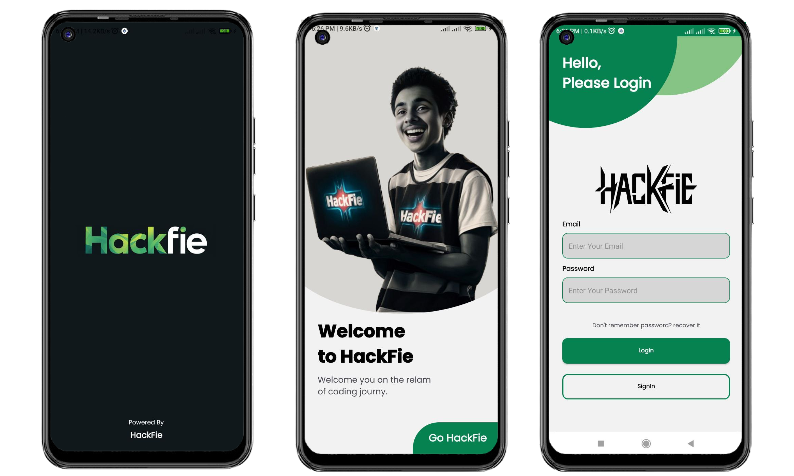
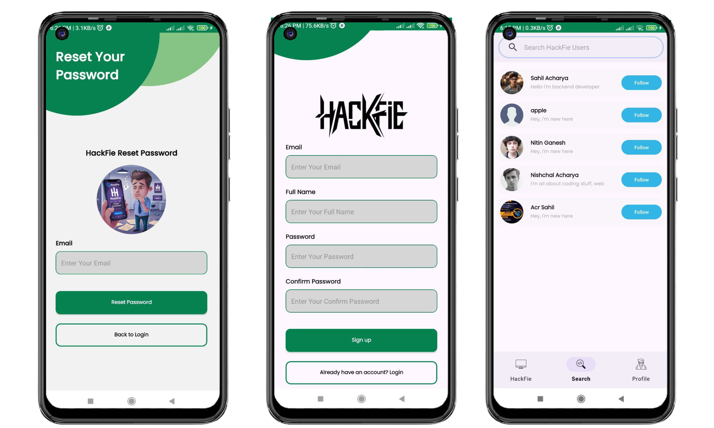
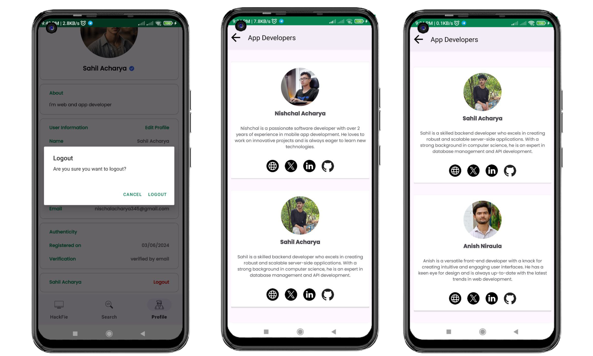

# HackFie 📱

<p align="center">
  <a href="https://github.com/Nischal-Acharya/HackFie-Social-Messaging-App/graphs/contributors"></a>
  <a href="https://github.com/Nischal-Acharya/HackFie-Social-Messaging-App/stargazers"></a>
  <a href="https://github.com/Nischal-Acharya/HackFie-Social-Messaging-App/forks"></a>
  <a href="https://github.com/Nischal-Acharya/HackFie-Social-Messaging-App/blob/main/LICENSE"></a>
</p>

## Overview
HackFie is a dynamic social messaging app designed to connect users in a secure and fun environment. Developed using Kotlin, it offers a seamless and efficient messaging experience.
 
## Technologies Used
- Kotlin ☕
- Android SDK 📱
- Firebase 🔥
- Retrofit 🚀
- Glide 🎨
- Material Design 🌐

## Installation

### Android Studio
1. **Clone this repository to your local machine**:
    ```sh
    git clone https://github.com/Nischal-Acharya/HackFie-Social-Messaging-App.git
    ```
2. **Open the project** in Android Studio.
3. **Build the project** to resolve all dependencies.
4. **Run the application** on an emulator or a physical device.

## Features
- **Instant Messaging**: Send and receive messages instantly.
- **User Status**: Individual knows user status like Active, Offline, Typing etc.
- **Media Sharing**: Share photos, videos, and other files.
- **Secure Communication**: End-to-end encryption for privacy.
- **Password Recover**: In case of forgot password user can recover with forgot password section.
- **Customizable & Flexible Profile**: Users can update their profile if they want.

## Screenshots

### Splash and Login


##
### Forgot Password, Sign In and Search


##
### Chat, Delete Message and Update Profile


##
### Logout and Developers



##
## Usage

1. **Sign Up/Log In**: Create an account or log in with your existing credentials.
2. **Add Friends**: Add friends using their unique HackFie IDs.
3. **Start Chatting**: Select a friend and start messaging instantly.
4. **Media Sharing**: Share photos, videos, and other files.

## Contributing

We welcome contributions! Follow these steps to contribute:

1. **Fork the repository**: Click the fork button to create a copy.
2. **Clone your fork**:
    ```sh
    git clone https://github.com/Nischal-Acharya/HackFie-Social-Messaging-App.git
    ```
3. **Create a new branch**:
    ```sh
    git checkout -b feature_branch
    ```
4. **Commit your changes**:
    ```sh
    git commit -m 'Add new feature'
    ```
5. **Push to the branch**:
    ```sh
    git push origin feature_branch
    ```
6. **Create a pull request**: Submit a pull request to merge your changes.

## License

HackFie is licensed under the [MIT License](LICENSE).

## Contact

For any inquiries or support, please contact:

- **Email**: [nismsg1@gmail.com](mailto:nismsg1@gmail.com)
- **GitHub**: [Nischal-Acharya](https://github.com/https://Nischal-Acharya)
- **Twitter**: [@nishchal_acc](https://twitter.com/nishchal_acc)

## Developers

Feel free to reach out to the developers.

| Developers        | Portfolio                                    | Photo |
| ----------------- | -------------------------------------------- |-------|
| Nishchal Acharya       | [https://nishchalacharya.com.np/](https://nishchalacharya.com.np/)         |  |
| Sahil Acharya       | [https://sahilacharya.com.np/](https://sahilacharya.com.np/)         |  |

Enjoy using HackFie and feel free to modify it! 🎉
